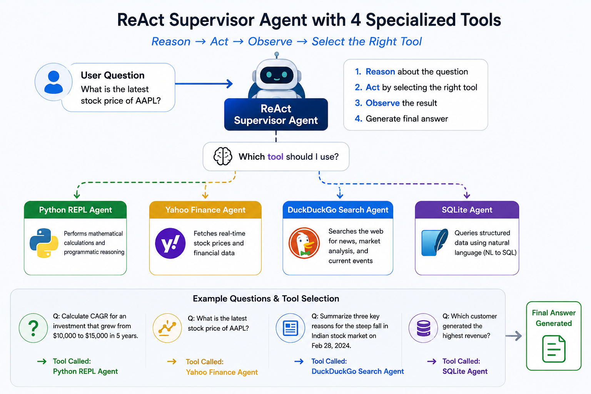

# LangChain ReAct Agent: Dynamic Tool Selection

<p align="center">
  
</p>

## Overview

# LangChain ReAct Agent: Dynamic Tool Selection with Multiple Tools

## Overview

This notebook explores the ReAct (Reason + Act + Observe) framework using LangChain and investigates how an agent can dynamically select the most appropriate tool based on user intent.

The objective was not to compare frameworks through theory, but to observe how a ReAct agent reasons about a problem, chooses a tool, executes the action, and generates a final response.

## Architecture

The ReAct Agent was provided access to multiple tools:

### 1. Python REPL Tool

Used for mathematical calculations and programmatic reasoning.

Example:

```text
If $450 amounts to $630 in 6 years, what will it amount to in 2 years at the same interest rate?
```

The agent reasons that a calculation is required and invokes the Python REPL tool.

### 2. Financial Research Toolset

#### Yahoo Finance Tool

Used for stock prices, market data, and financial information.

Example:

```text
What is the latest stock price of AAPL?
```

#### DuckDuckGo Search Tool

Used for financial news, market analysis, and current events.

Example:

```text
Summarize three key reasons for the steep fall in the Indian stock market on February 28, 2024.
```

The agent determines which tool is most appropriate based on the user's request.

### 3. SQLite Agent

Used to query structured data using natural language.

Example:

```text
Which customer generated the highest revenue?
```

The SQLite Agent translates natural language into SQL queries, executes them against the database, and returns results in plain English.

## What This Notebook Demonstrates

### Dynamic Tool Selection

One of the key observations is that tool selection is not hardcoded.

The ReAct framework follows:

```text
Reason → Act → Observe
```

The agent:

1. Analyzes the user's intent
2. Selects the appropriate tool
3. Executes the action
4. Observes the result
5. Produces the final answer

### ReAct vs Workflow Orchestration

This experiment also highlights the distinction between LangChain ReAct and LangGraph.

**ReAct**

* Dynamic tool selection
* Flexible reasoning
* Lightweight architecture
* Fast prototyping

**LangGraph**

* Workflow orchestration
* State management
* Deterministic routing
* Guardrails and retries
* Production observability

A practical production architecture may combine both:

```text
User Question
      ↓
LangGraph Supervisor
      ↓
ReAct Agent
      ↓
Tool Selection
      ↓
Final Response
```

## Key Learnings

* ReAct is effective when an agent must choose between multiple tools.
* Tool descriptions play a critical role in tool selection accuracy.
* ReAct agents can fail due to parsing errors or incorrect tool choices.
* Production systems require retries, logging, fallback strategies, and guardrails.
* LangGraph and ReAct are complementary rather than competing approaches.

## Technologies Used

* Python
* LangChain
* OpenAI GPT-4o
* Python REPL
* DuckDuckGo Search
* Yahoo Finance
* SQLite
* Jupyter Notebook

## Repository Contents

* `ReAct_LangChainAgent.html` – Exported notebook
* `ReAct_LangChainAgent.pdf` – PDF version

## Conclusion

This experiment reinforced that ReAct remains valuable for dynamic tool selection, while frameworks such as LangGraph excel at orchestration, state management, and production-scale workflows.

The most interesting takeaway was not whether one framework is better than the other, but understanding where each fits within a modern AI architecture.
